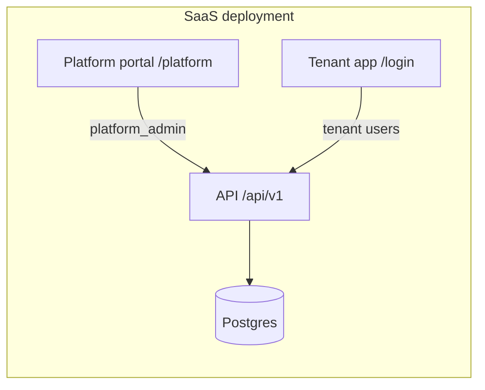

# Platform tenant management portal

HelixGuard separates **tenant application** access from **SaaS operator** tenant lifecycle management.

## Deployment modes

| Mode | Config | Portal |
|------|--------|--------|
| SaaS | `DEPLOYMENT_MODE=saas`, `PLATFORM_PORTAL_ENABLED=true` | Enabled at `/platform` |
| On-prem / air-gap | `DEPLOYMENT_MODE=onprem`, `PLATFORM_PORTAL_ENABLED=false` | Disabled (API returns 404) |

On-premises installs typically ship a single tenant (or manually provisioned tenants) without exposing a multi-tenant operator UI.

## Architecture



- **Platform tenant** (`PLATFORM_TENANT_SLUG`, default `platform`): hosts `platform_admin` users only.
- **Customer tenants**: created via platform portal; each gets an isolated row set keyed by `tenant_id`.
- **Demo data**: optional `include_demo_data` flag runs governance + access seed helpers for the new tenant.

## API

Public:

- `GET /api/v1/platform/config` — portal availability and deployment mode.

Protected (`platform_admin` on platform tenant, `manage_tenants` permission):

- `GET /api/v1/platform/tenants`
- `POST /api/v1/platform/tenants` — provision tenant; body includes `include_demo_data`
- `PATCH /api/v1/platform/tenants/{id}` — rename or suspend/activate

When `PLATFORM_PORTAL_ENABLED=false`, protected routes respond with **404**.

## Default credentials (dev seed)

| Portal | Email | Password | Tenant slug |
|--------|-------|----------|-------------|
| Platform | `platform@helixguard.local` | `platform1234` | `platform` |
| Demo customer | `admin@acme.com` | `demo1234` | `acme` |

## Docker Compose

**SaaS (default `docker-compose.yml`):**

```yaml
DEPLOYMENT_MODE: saas
PLATFORM_PORTAL_ENABLED: "true"
```

**Air-gap / on-prem (`docker-compose.airgap.yml`):**

```yaml
DEPLOYMENT_MODE: onprem
PLATFORM_PORTAL_ENABLED: "false"
```

## UI routes

| Route | Purpose |
|-------|---------|
| `/platform/login` | Platform operator sign-in |
| `/platform` | Tenant list, suspend/activate |
| `/platform/tenants/new` | Provision tenant with optional demo data |
| `/login` | Customer tenant application (unchanged) |

Platform admins signing in through `/login` are redirected to `/platform`.
