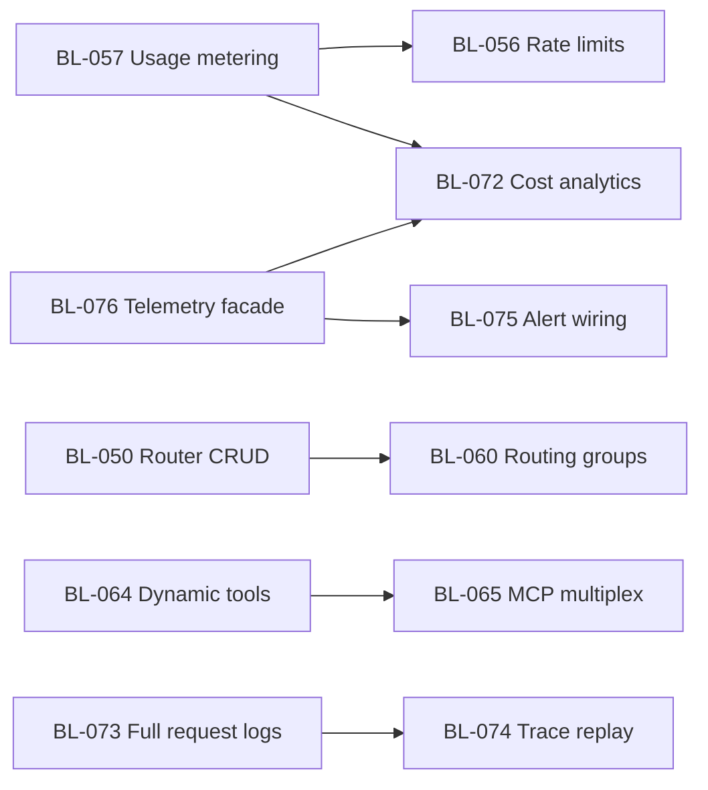

# Gateway & Platform Parity Roadmap

**Last updated:** Aug 14, 2026  
**Purpose:** Close the gap vs. full-stack AI gateway platforms (OpenRouter Enterprise, Lakera, Prompt Security, QuirlAI-class products) while keeping PySetu’s MCP governance and air-gap differentiators.

**Related:** [product-roadmap.md](./product-roadmap.md) · [backlog.md](./backlog.md) · [phase-7-sprint.md](./phase-7-sprint.md)

---

## Executive summary

PySetu today is strong on **governance, audit, compliance UI, UAG v1, and MCP admin**. It is **not** yet a complete AI gateway product across cost optimization, MCP marketplace, per-user metering, prompt lifecycle, and production alerting.

This plan adds **Phases 7–10** (Sprints 8–14, estimated) to reach **competitive parity** on the capability sets shown in enterprise gateway marketing (7-stage pipeline, dynamic MCP tool calling, MCP platform, cost/routing, observability, CISO security bundle).

---

## Parity matrix (target state)

Legend: **Have** · **Partial** (extend) · **Gap** (net-new)

### 1 — Seven-stage gateway pipeline

| Capability | Today | Target | Backlog |
|------------|-------|--------|---------|
| Identity & Auth (JWT, OIDC/Okta/Google) | Partial | Have | BL-042 ✓, BL-057, BL-058 |
| Per-user / per-team AI usage & attribution | Gap | Have | BL-057, BL-053 |
| Domain allowlists (login / API) | Gap | Have | BL-058 |
| AI traffic rate limits (req/min/hr/day) | Have ✓ | Have | BL-056 ✓ |
| Token budgets (tenant, team, model) | Have ✓ | Have | BL-056 ✓ |
| Security guardrails (PII/PHI/PCI, injection) | Partial | Have | BL-014 ✓, BL-082, BL-023 ✓ |
| Response-path guardrails (ingress + egress) | Have ✓ | Have | BL-059 ✓ |
| Custom intents (trainable classifiers) | Gap | Have | BL-062 |
| Prompt store (versioned, `{{vars}}`, enforce) | Gap | Have | BL-061 |
| Token saving (JSON→TOON / compression) | Partial | Have | BL-063 |
| Weighted routing groups | Partial | Have | BL-050, BL-060 |
| Group name as model parameter | Gap | Have | BL-060 |
| Auto-failover across providers | Gap | Have | BL-060 |
| Regional routing (Bedrock + Vertex) | Have | Have | BL-077 ✓ |

### 2 — Dynamic tool calling (MCP)

| Capability | Today | Target | Backlog |
|------------|-------|--------|---------|
| Select relevant MCP tools per request (~200 vs 15K tokens) | Have ✓ | Have | BL-064 |
| Automatic tool ranking / filtering | Have ✓ | Have | BL-064 |
| Measurable token reduction KPIs | Partial | Have | BL-064, BL-072 |

### 3 — MCP platform

| Capability | Today | Target | Backlog |
|------------|-------|--------|---------|
| MCP multiplex (single gateway URL) | Have ✓ | Have | BL-065 |
| Curated MCP library + one-click install | Have ✓ | Have | BL-066 |
| Custom MCP via transport URL | Have ✓ | Have | BL-066 |
| OAuth auth mediation for MCP tools | Have ✓ | Have | BL-067 |
| Tool risk taxonomy (read/write/destructive) | Have ✓ | Have | BL-068 |
| Agent auto-detection + per-agent MCP toggles | Have ✓ | Have | BL-069 |
| Self-service MCP / AI portal | Have ✓ | Have | BL-070 |
| Web search MCP + enterprise URL filtering | Have ✓ | Have | BL-071 |
| **REST-to-MCP auto-proxy** (OpenAPI/Postman/GraphQL → MCP) | Have ✓ | Have | **BL-083** — UI wizard + backend spec-proxy |
| **SSO context credential injection** (OIDC token → REST backend; LLM never sees key) | Partial | Have | **BL-084** |
| **Tool-level RBAC explicit deny lists** (per group, per tool) | Partial | Have | **BL-085**, **BL-099** (gateway enforce) |
| **Policy bundle ↔ MCP tool scope** (per workload allowlist) | Gap | Have | **BL-101**, **BL-103** |
| **MCP invoke audit + DLP on live gateway path** | Partial | Have | **BL-098**, **BL-100** |
| **Compliance metadata on audit** (purpose, lawful basis) | Gap | Have | **BL-104** |
| **Framework rule packs** (GDPR/HIPAA/ISO/SOC2) | Gap | Have | **BL-106** |
| **Trust score fleet donut chart** (Low/Medium/High distribution) | Have ✓ | Have | **BL-090** |
| **MCP governance alert feed** (high-risk calls, access anomalies, blocks) | Have ✓ | Have | **BL-089** |

### 4 — Cost & routing

| Capability | Today | Target | Backlog |
|------------|-------|--------|---------|
| Token saving dashboard (before/after) | Partial | Have | BL-063, BL-072 |
| Compounding savings narrative (routing + tools + compression) | Have ✓ | Have | BL-063, BL-064, BL-060 |
| Gateway overhead / SLA operator metrics | Have | Have | BL-055, BL-078 ✓ |
| Connection pooling / latency optimization | Have | Have | BL-078 ✓ — shared HTTP pool reuse instrumented |
| **Enhanced visual routing engine** (SVG fan-out, traffic %, cloud/air-gap badges) | Have ✓ | Have | **BL-086** |
| **Per-rule response format UI** (OpenAI/Anthropic/Vertex/Universal) | Have ✓ | Have | **BL-087** |
| **API key ↔ routing rule binding** (explicit assignment panel) | Have ✓ | Have | **BL-088** |
| **Model performance tab in Router** (latency + throughput per model) | Have ✓ | Have | **BL-091** |

### 5 — Observability & alerting

| Capability | Today | Target | Backlog |
|------------|-------|--------|---------|
| Per-user / team / model token & cost analytics | Have | Have | BL-072 ✓ |
| Full request logs (prompt, response, tool, guardrail) | Have | Have | BL-073 ✓ |
| Trace replay (OTel-native, stage-by-stage) | Have | Have | BL-074 ✓ |
| Real-time alerts (blocks, budget, latency, outage) | Partial | Have | BL-075 |
| Telemetry facade (`/telemetry/*`) | Have | Have | BL-076 ✓ |
| Live ops dashboard (requests, tokens, p50, blocks) | Partial | Have | BL-076, Monitoring ✓ |

### 6 — CISO / security bundle

| Capability | Today | Target | Backlog |
|------------|-------|--------|---------|
| PII block / redact / monitor | Partial | Have | BL-014 ✓ |
| PHI / PCI / financial classifiers | Have | Have | BL-082 ✓ |
| Prompt injection & jailbreak (every call) | Have | Have | BL-023 ✓ |
| Red team testing (adversarial prompt suite) | Partial | Have | BL-080 |
| Endpoint agent (TLS inspect + DLP desktop) | Gap | Have | BL-079 |
| Claude.ai org compliance API sync | Partial | Have | BL-081 — local sync adapter complete; provider credential/pull integration remains |
| Automatic compliance evidence from pipeline | Partial | Have | BL-052 |

---

## Phased delivery

### Phase 7 — Traffic control & routing parity (Sprints 8–9)

**Goal:** Enterprise-grade limits, metering foundation, routing groups with failover.

| Sprint | Focus | Items |
|--------|-------|-------|
| 8 | Rate limits & budgets | BL-056, BL-057 (usage hooks), BL-058 |
| 9 | Routing groups & failover | BL-060, BL-050 (complete), BL-077 (design + Azure/Bedrock spike) |

**Exit criteria:** Tenant can set req/token budgets; routing group resolves model alias with weighted failover; usage attributed per user/API key.

---

### Phase 8 — Prompt lifecycle & cost optimization (Sprints 10–11)

**Goal:** Prompt store, custom intents, token compression, dynamic MCP tools.

| Sprint | Focus | Items |
|--------|-------|-------|
| 10 | Prompt store + egress guardrails | BL-061, BL-059 |
| 11 | Token saving + dynamic tool calling | BL-063, BL-064, BL-062 (MVP classifier training) |

**Exit criteria:** Prompt versions enforced at gateway; measurable token reduction on MCP and JSON payloads; custom intent rules deployable without code change.

---

### Phase 9 — MCP platform & observability (Sprints 12–13)

**Goal:** MCP marketplace experience, full observability, production alerting.

| Sprint | Focus | Items |
|--------|-------|-------|
| 12 | MCP platform | BL-065, BL-066, BL-067, BL-068, BL-069, BL-070 |
| 13 | Observability depth | BL-072, BL-073, BL-074, BL-075, BL-076 |

**Exit criteria:** Catalog install flow; multiplex URL documented; webhooks fire on guardrail block and budget breach; per-user cost view; trace replay from OTel.

---

### Phase 10 — Enterprise security & polish (Sprint 14+)

**Goal:** CISO bundle, red team, optional endpoint agent, regional GA.

| Sprint | Focus | Items |
|--------|-------|-------|
| 14 | Security bundle + regions | BL-080, BL-082, BL-081, BL-077 GA, BL-078 |
| 15+ | Endpoint agent (optional) | BL-079 — separate product track; air-gap compatible agent |

**Exit criteria:** Red team report export; PHI/PCI policies in Data Protection; regional routing groups in UI; SLA dashboard for operators.

---

### Phase 11 — HelixGuard Parity: LLM Router & MCP UX (Sprints 13–16)

**Goal:** Close UX and capability gaps identified against HelixGuard AI. Turn any REST API into an MCP server and elevate LLM Router to a visual, self-service control plane.

> **Source:** HelixGuard AI dashboard analysis — Aug 13, 2026

| Sprint | Focus | Items |
|--------|-------|-------|
| 13 | MCP governance quick wins | BL-085 (tool deny lists), BL-089 (MCP alert feed), BL-090 (trust donut) |
| 14 | LLM Router & MCP UX polish | BL-084 (SSO injection), BL-086 (visual router), BL-087 (format config), BL-088 (key binding), BL-091 (perf tab) |
| 15–16 | REST-to-MCP flagship | BL-083 (OpenAPI/Postman/GraphQL auto-proxy wizard) |

**Exit criteria:** Any REST API with an OpenAPI spec can be registered as an MCP server via 3-step wizard; SSO token injection active for REST-backed MCP servers; LLM Router shows visual fan-out diagram with traffic %; tool-level RBAC deny lists available per RBAC group.

---

## Dependencies

---

## Success metrics (parity KPIs)

| Metric | Target |
|--------|--------|
| MCP tokens per tool call | ≥50% reduction vs. full catalog (dynamic tool calling) |
| JSON payload token savings | ≥30% on eligible structured inputs (token saving) |
| Alert delivery latency | &lt;60s from guardrail block to webhook |
| Per-user cost attribution | 100% of gateway requests tagged user/team/key |
| Routing failover | Automatic switch within 1 failed upstream call |
| Parity backlog completion | BL-056–BL-082 done for M8 |

---

## Milestones

| ID | Name | Target | Backlog range |
|----|------|--------|---------------|
| M8 | Gateway Pipeline Parity | Sprint 9 | BL-056–BL-060, BL-058 |
| M9 | Cost & Prompt Parity | Sprint 11 | BL-061–BL-064, BL-062 |
| M10 | MCP Platform & Observability | Sprint 13 | BL-065–BL-076 |
| M11 | Enterprise Security Parity | Sprint 14+ | BL-077–BL-082, BL-079 optional |
| **M12** | **HelixGuard Parity — LLM Router & MCP UX** | **Sprint 15–16** | **BL-083–BL-091** | **Complete — BL-083–BL-091 delivered; BL-079 remains optional** |
| M13 | Quality & shared primitives (not feature parity) | Sprint 17 | BL-092–BL-097 | Complete Aug 14 — [quality-audit-sprint.md](./quality-audit-sprint.md) |
| **M14** | **MCP compliance pipeline** (Policy → Router → Audit) | **Sprint 18–20** | **BL-098–BL-108** | [mcp-policy-pipeline-design.md](./mcp-policy-pipeline-design.md) |

---

### Phase 13 — MCP compliance pipeline (Sprints 18–20)

**Goal:** Merge bundle-based MCP scope with the compliance pipeline north star — gated, audited, inspectable MCP on the live gateway path.

| Sprint | Focus | Items |
|--------|-------|-------|
| 18 | Layer 1 — enforcement | BL-098–BL-103 |
| 19 | Layer 2 — compliance metadata + tool response redaction | BL-104, BL-105 |
| 20+ | Layer 3 — framework packs, retention, WORM | BL-106–BL-108 |

**Exit criteria (Layer 1):** Every `tools/call` audited; deny lists and bundle allowlists enforced; DLP on args/results; routing rules respect assigned API keys; DEF-001 / MCP-005 / MCP-009 closed.

---

## Out of scope (explicit)

- Billing/invoicing integration (BL-053) — metering hooks only until commercial pilot
- SAML 2.0 (BL-047) — unless enterprise deal requires
- 150+ third-party MCP legal/hosting commitments — catalog is curated + partner integrations, not unlimited marketplace day one

---

## Review cadence

- **Monthly:** Parity matrix status (Have / Partial / Gap) updated in this doc
- **Sprint planning:** Pull next phase items from [backlog.md](./backlog.md) P1 parity section
- **QA:** Each BL item requires test catalog entry in [uag-test-plan.md](../testing/uag-test-plan.md) or [test-plan.md](../testing/test-plan.md)
