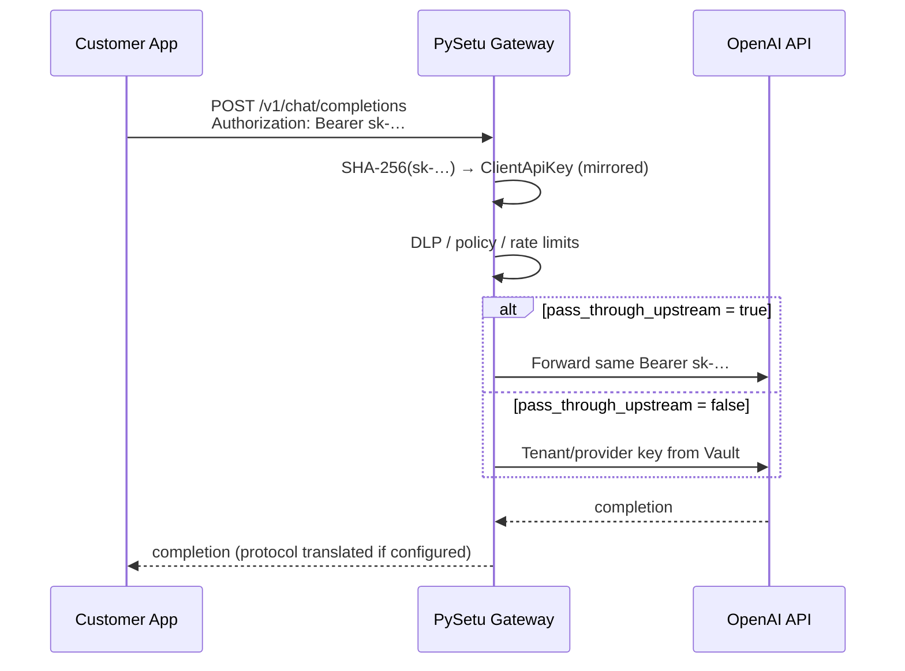

# Client API Key Origins & BYOK Ingress — Design Spec

**Status:** Draft (Aug 15, 2026)  
**Authors:** Platform / Gateway  
**Related:** [MCP Policy Pipeline Design](../../planning/mcp-policy-pipeline-design.md) · [Implementation Plan](../plans/2026-08-15-api-key-origins-and-byok.md) · BL-058 (tenant API origins, shipped)

---

## Problem

Two related gateway authentication gaps block common enterprise adoption patterns:

1. **Per-key origin allowlists** — `allowed_api_origins` is tenant-wide (`tenants.allowed_api_origins`). Security teams want tighter scoping: e.g. a browser-facing SPA key restricted to `https://app.acme.com`, while a server-side integration key has no origin restriction.

2. **BYOK ingress / key mirroring** — Customers migrating from direct OpenAI (or other provider) calls want to point existing SDKs at the PySetu gateway with **only a base-URL change**, keeping `Authorization: Bearer sk-…` unchanged. Today ingress keys must use the PySetu-generated `hg_…` prefix.

---

## Current Architecture (as implemented)

### Client API keys

| Layer | Location | Behavior |
|-------|----------|----------|
| Model | `backend/app/models/governance.py` → `ClientApiKey` | `key_prefix`, `key_hash` (SHA-256), optional per-key limits, `client_response_protocol`, `token_saving_*`, `bundle_id` |
| Service | `backend/app/services/client_api_key_service.py` | `KEY_PREFIX = "hg_"`; `generate_client_key()`; `resolve_client_api_key()` **rejects non-`hg_` tokens** |
| Admin API | `backend/app/api/v1/access.py` | CRUD at `/client-api-keys`; create returns plaintext once |
| Schemas | `backend/app/schemas/access.py` | Request/response DTOs |

Per-key nullable fields already follow an **inherit tenant default** pattern (e.g. `token_saving_enabled: null` → tenant gateway default). This spec extends the same pattern to origins.

### Gateway authentication

```
Authorization: Bearer <token>
        │
        ▼
get_gateway_context()  — backend/app/core/gateway_deps.py
        │
        ├─ token.startswith("hg_") ──► resolve_client_api_key() ──► GatewayContext (key limits, bundle, …)
        │
        └─ else ──► decode_access_token() (JWT) ──► GatewayContext (user, default bundle)
```

Origin enforcement (client keys only):

```python
# gateway_deps.py (simplified)
if tenant.allowed_api_origins:          # tenant-level only today
    origin = request.headers.get("origin")
    if not origin or origin not in tenant.allowed_api_origins:
        raise 403
```

**Notes:**

- Empty / `null` tenant `allowed_api_origins` → **no origin check** (server-to-server calls without `Origin` header are allowed).
- FastAPI CORS (`settings.cors_origins` in `main.py`) is **separate** from gateway origin policy; CORS handles browser preflight, gateway policy handles authenticated ingress.

### Tenant gateway settings (UI)

| UI | API | Field |
|----|-----|-------|
| `frontend/src/components/settings/gateway-settings.tsx` (tab: API origins) | `PUT /settings/gateway` | `tenants.allowed_api_origins` |
| `frontend/src/components/settings/access-settings.tsx` | `/client-api-keys` | Keys, bundles, per-key limits |
| `frontend/src/components/settings/api-key-limits.tsx` | — | Rate/token/token-saving overrides |

### Upstream (egress) keys — separate concern

Tenant and provider API keys for **outbound** LLM calls are stored via `secrets_service.py` (Vault KV paths under `pysetu/tenants/{tenant_id}/…`). Resolved in `integration_service.resolve_gateway_config()` and per-provider `LLMProvider.api_key`.

BYOK ingress is **not** the same as tenant integration keys, though a mirrored ingress key may optionally be **forwarded** to the upstream provider at request time (see below).

---

## Goals

1. **Per-key `allowed_api_origins`** — nullable JSONB on `client_api_keys`; `null` inherits tenant list; non-null overrides for that key only.
2. **BYOK ingress** — Register a customer's existing provider key (`sk-…`, etc.) as a client API key; gateway accepts it as Bearer token with no app-side key change.
3. **Minimal app migration** — Change `base_url` only; same `Authorization` header and SDK behavior.
4. **Consistent security model** — Ingress secrets remain **hash-at-rest**; optional stateless pass-through to upstream without persisting plaintext.

## Non-goals

- Replacing tenant-wide origin defaults (they remain the baseline).
- Storing mirrored ingress keys in Vault (hash-only at rest; see security section).
- Automatic sync when customer rotates keys at the provider (manual re-register or explicit rotate API).
- Per-key CORS middleware changes (gateway policy only).
- Using BYOK ingress keys for MCP multiplex or JWT-protected admin routes.

---

## Feature 1: Per-key Allowed API Origins

### Data model

Add to `client_api_keys`:

```sql
allowed_api_origins JSONB NULL   -- null = inherit tenant
```

Alembic revision e.g. `061_client_api_key_origins.py`.

### Resolution algorithm

Introduce `resolve_effective_api_origins(key, tenant) -> list[str] | None`:

| Key `allowed_api_origins` | Tenant `allowed_api_origins` | Effective behavior |
|---------------------------|------------------------------|--------------------|
| `null` | `null` or `[]` | No check |
| `null` | `["https://a.com"]` | Enforce tenant list |
| `[]` | any | **No check** (explicit key override: allow all origins for this key) |
| `["https://b.com"]` | any | Enforce key list only |

When effective list is non-empty:

1. Require `Origin` header on the request.
2. Reject with `403` if `Origin` ∉ effective list.

This mirrors tenant semantics (`[]` / empty = allow all) while letting a key **relax** a tenant-wide restriction via `[]`.

### API / schema changes

**`ClientApiKeyResponse`**, create, update:

```python
allowed_api_origins: list[str] | None = None
allowed_api_origins_mode: Literal["inherit", "allow_all", "restrict"]  # computed for UI only
```

For updates, use the same tri-state pattern as token saving:

- Omit field → no change
- `null` → inherit tenant
- `[]` → allow all (override)
- `["https://…"]` → restrict

**Validation:** HTTPS origins only (except `http://localhost:*` in dev); normalize trailing slashes; max 50 entries; reject duplicates.

### Gateway change

In `gateway_deps.py`, after resolving `ClientApiKey`:

```python
effective = resolve_effective_api_origins(record, tenant)
if effective:
    origin = request.headers.get("origin")
  ...
```

JWT-authenticated gateway calls are unchanged (no origin gate today).

### UI changes

**`access-settings.tsx` / `api-key-limits.tsx`:**

- Add **Allowed origins** section per key (create + edit):
  - `Inherit tenant default` (default)
  - `Allow any origin`
  - `Restrict to:` comma-separated list
- Show effective summary on key card: e.g. `Origins: inherit (tenant: 2 hosts)` or `Origins: https://app.acme.com`.

**`gateway-settings.tsx`:** Add cross-link: “Per-key overrides → Client API keys.”

---

## Feature 2: BYOK Ingress (Key Mirroring)

### Concept

A **mirrored** client API key is registered by hashing the customer's existing provider secret once at creation. At runtime:

1. Gateway hashes incoming Bearer token and looks up `client_api_keys.key_hash` (any prefix).
2. Policy bundle, rate limits, and origin rules apply as for `hg_` keys.
3. Optionally, the **same request Bearer token** is forwarded to the upstream OpenAI-compatible API (stateless pass-through).



### Data model

Add to `client_api_keys`:

```sql
key_source VARCHAR(16) NOT NULL DEFAULT 'pysetu'   -- 'pysetu' | 'mirrored'
upstream_pass_through BOOLEAN NOT NULL DEFAULT FALSE
key_prefix VARCHAR(32) NOT NULL   -- existing; for mirrored: first 12 chars of sk-… for display
```

- **`key_source = 'pysetu'`** — Existing behavior; `generate_client_key()` produces `hg_…`.
- **`key_source = 'mirrored'`** — Created from admin-supplied provider key; `key_hash = SHA-256(raw)`; `key_prefix` derived from raw key (e.g. `sk-proj-abcd`).

`resolve_client_api_key()` changes:

```python
async def resolve_client_api_key(db, raw_key: str) -> ClientApiKey | None:
    key_hash = hash_client_key(raw_key)
    result = await db.execute(
        select(ClientApiKey).where(
            ClientApiKey.key_hash == key_hash,
            ClientApiKey.is_active.is_(True),
        )
    )
    ...
```

Remove the `hg_` prefix gate in the resolver (prefix becomes a display concern only).

`get_gateway_context()` branch condition broadens:

```python
record = await resolve_client_api_key(db, token)
if record is not None:
    ...  # client key path
elif looks_like_jwt(token):
    ...  # JWT path
else:
    raise 401
```

Use JWT structure heuristic (three dot-separated segments) to avoid treating opaque strings as JWTs.

### Create mirrored key (API)

**`POST /client-api-keys`** extended:

```json
{
  "name": "production-openai",
  "key_source": "mirrored",
  "mirrored_api_key": "sk-proj-…",
  "upstream_pass_through": true,
  "bundle_id": "…",
  "allowed_api_origins": null
}
```

- `mirrored_api_key` required when `key_source=mirrored`; never returned after create.
- Reject if hash already exists (global uniqueness on `key_hash`).
- Optional: reject keys matching known weak patterns in production.

**`POST /client-api-keys/mirrored`** (alternative dedicated endpoint) — preferred for clearer audit and RBAC; same body minus `key_source`.

### Upstream pass-through (egress)

When `upstream_pass_through=true` and request authenticated via mirrored key:

- `gateway_service` / provider client uses **the inbound Bearer token** for the outbound `Authorization` header.
- Token is held in request-scoped context only (`GatewayContext.ingress_bearer_token`); never written to DB, logs, or Vault.
- Audit logs record `client_api_key_id` and `key_source=mirrored`; **never** the raw token.

When `upstream_pass_through=false`:

- Mirrored key is **ingress-only**; egress uses existing `resolve_gateway_config()` / provider keys (useful when customer wants PySetu policies on a shared ingress alias but centralized billing key).

### Storage: Vault vs hash-only

| Secret | At rest | Runtime |
|--------|---------|---------|
| PySetu `hg_` key | SHA-256 hash in Postgres | N/A (customer stores hg_ key) |
| Mirrored ingress `sk-…` | SHA-256 hash in Postgres | Plaintext only in request memory if pass-through |
| Tenant/provider egress keys | Vault KV (preferred) or Postgres fallback | Loaded per request from Vault |

**Recommendation:** Do **not** store mirrored ingress keys in Vault. Rationale:

- Customer already holds the canonical secret at the provider.
- Hash lookup is sufficient for authentication.
- Pass-through avoids persisting plaintext entirely.
- Vault paths are better reserved for platform-managed egress secrets.

If pass-through is disabled, ingress and egress keys are intentionally different — no need to store ingress plaintext.

### Security tradeoffs

| Topic | Risk | Mitigation |
|-------|------|------------|
| Leaked `sk-` | Attacker bypasses PySetu OR uses gateway | Per-key origins, rate limits, policy bundles; recommend pass-through only when customer accepts provider-side billing exposure |
| Hash-only storage | Cannot “reveal” key after create | Same as `hg_` keys; document one-time copy on create |
| Global hash index | Cross-tenant hash collision (negligible) | Keep unique index on `key_hash`; reject duplicate on create |
| Audit / DLP | Token in request bodies | Existing redaction (`SECRET_PATTERN`, injection detection); extend to never log `Authorization` |
| Key rotation | Stale mirrored hash | Rotate endpoint: supply new `mirrored_api_key`, update hash; deactivate old |
| JWT ambiguity | Opaque token decoded as JWT | JWT heuristic before `decode_access_token` |

**Recommended default:** `upstream_pass_through=true` for mirrored keys created via “URL change only” wizard; admin UI warns that provider billing and limits apply directly.

### RBAC & audit

- Create/rotate mirrored keys: `MANAGE_POLICIES` (same as client keys today).
- Audit actions: `client_api_key.mirrored.create`, `client_api_key.mirrored.rotate`, `client_api_key.origins.update`.
- Risk level: **high** for mirrored key create/rotate.

---

## Migration Path

### Existing `hg_` keys

- No data migration required for origins (column defaults `NULL` → inherit tenant).
- No change to existing key hashes or prefixes.
- `key_source` defaults to `'pysetu'`.

### Existing tenants with `allowed_api_origins`

- Behavior unchanged until a key sets an override.
- Document that server-to-server keys should set per-key `allowed_api_origins: []` if tenant later adds browser origins.

### Rollout

1. Ship DB migration + backend resolution (feature-flag optional: `BYOK_INGRESS_ENABLED`).
2. Ship UI for per-key origins (can ship independently of BYOK).
3. Ship mirrored key create + pass-through behind flag; enable per tenant in config if needed.

---

## API Summary

| Method | Path | Change |
|--------|------|--------|
| GET | `/client-api-keys` | +`allowed_api_origins`, +`key_source`, +`upstream_pass_through` |
| POST | `/client-api-keys` | +optional `key_source`, `mirrored_api_key`, `upstream_pass_through`, `allowed_api_origins` |
| POST | `/client-api-keys/mirrored` | **New** — dedicated mirrored create |
| PUT | `/client-api-keys/{id}` | +`allowed_api_origins`; +`upstream_pass_through` (not raw key) |
| POST | `/client-api-keys/{id}/rotate` | **New** — for mirrored: new `mirrored_api_key`; for pysetu: new `hg_` key |

---

## UI Summary (Client API keys)

| Control | Values |
|---------|--------|
| Key type | PySetu generated (default) / Mirrored (BYOK) |
| Mirrored key input | Password field; shown once on create |
| Upstream pass-through | Toggle (default on for mirrored) |
| Allowed origins | Inherit / Allow any / Restrict list |
| Key card badges | `Mirrored`, `Pass-through`, origin mode |

Add help copy: “Change your OpenAI `base_url` to the PySetu gateway URL; keep your existing API key in the `Authorization` header.”

---

## Testing Plan (high level)

- Unit: `resolve_effective_api_origins` matrix (inherit / override / allow-all).
- Unit: `resolve_client_api_key` with `sk-` token and mirrored record.
- Integration: gateway 403 when origin blocked per key; server call without Origin allowed.
- Integration: mirrored key + pass-through mocks upstream `Authorization` header.
- Security: audit log does not contain `sk-`; create rejects duplicate hash.

---

## Open Questions

1. **Tenant feature flag** — Gate BYOK ingress per tenant/plan, or platform-wide?
2. **Provider prefix allowlist** — Restrict mirrored keys to `sk-`, `AIza…`, etc.?
3. **Rate-limit key namespace** — Keep `{tenant}:key:{id}` (no change needed).
4. **Gemini / Anthropic mirrored keys** — Same hash flow; pass-through only where provider client supports Bearer from context.

---

## Recommended Approach (summary)

| Area | Recommendation |
|------|----------------|
| Per-key origins | Nullable JSONB + `resolve_effective_api_origins`; `[]` = allow all override |
| BYOK ingress | `key_source=mirrored`; universal hash lookup; remove `hg_` gate in resolver |
| Storage | Hash-only in Postgres; **no Vault** for ingress mirrored keys |
| Egress | Stateless pass-through of inbound Bearer when `upstream_pass_through=true` |
| UI | Tri-state origins on key form; mirrored key wizard with pass-through default |
| Migration | Additive columns; existing keys unchanged |
